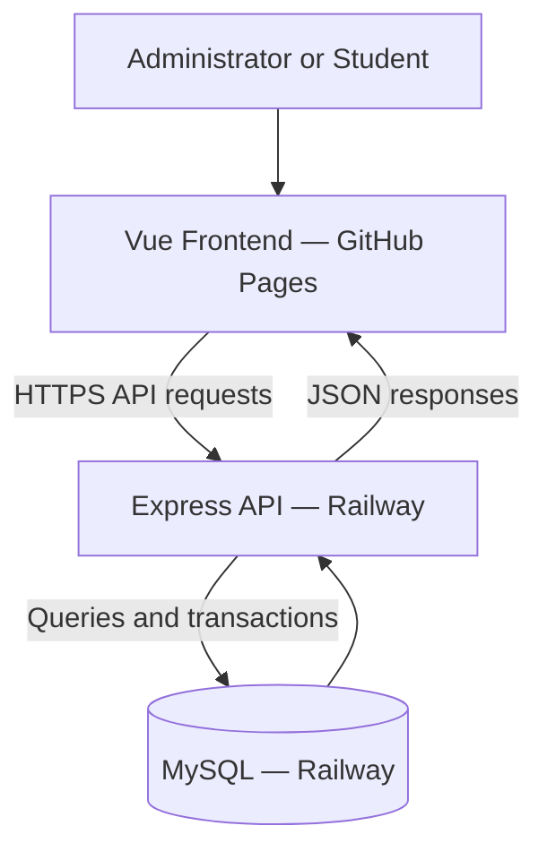
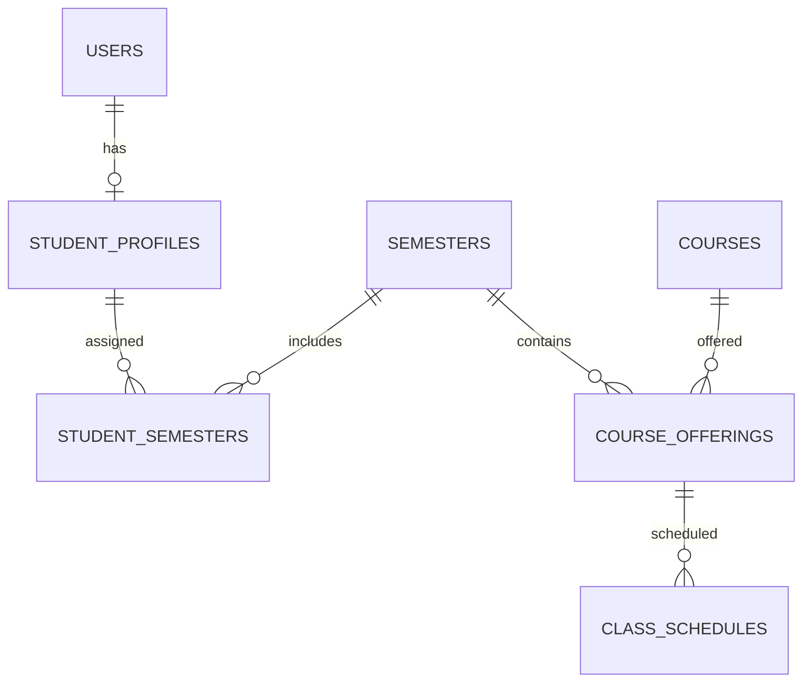

# StudentHub Architecture

**Team:** Team 1  
**Last updated:** 2026-10-07  

## Overview

StudentHub is a student life platform with separate administrator and student interfaces.

Administrators manage student accounts, semester assignments, course offerings, professors, and class meetings. Students view their academic information and update permitted contact details.

The application has three main layers:

| Layer | Technology | Responsibility |
|---|---|---|
| Frontend | Vue, TypeScript, Vite | Display information and collect user input |
| Backend | Node.js, Express, TypeScript | Authenticate users, validate requests, and apply business rules |
| Database | MySQL | Store accounts, profiles, and academic records |

## System Diagram



## User Roles

### Administrator

Administrators can:

- Create student accounts.
- Search and edit student records.
- Manage account active status.
- Assign students to semesters.
- Assign courses to semester and major groups.
- Edit offering professors.
- Create, edit, and remove timetable meetings.

### Student

Students can:

- Log in using an administrator-created account.
- View their profile.
- Update email, phone number, and address.
- View assigned semesters.
- View courses and meetings matching their major and semester.

Students cannot register themselves or perform administrator operations.

## Project Structure

```text
Team1/
├── .github/
│   └── workflows/
│       └── deploy-frontend.yml
├── backend/
│   ├── src/
│   │   ├── app.ts
│   │   ├── server.ts
│   │   ├── students.ts
│   │   ├── student-admin.ts
│   │   ├── semesters.ts
│   │   ├── courses.ts
│   │   ├── major-planning.ts
│   │   └── schedules.ts
│   └── tests/
├── database/
│   └── migrations/
├── frontend/
│   ├── src/
│   │   ├── api.ts
│   │   ├── App.vue
│   │   ├── schedules.ts
│   │   └── components/
│   └── vite.config.ts
└── README.md
```

## Frontend Responsibilities

### Application Entry

`App.vue` manages:

- Login and logout.
- Session restoration.
- Selection of administrator or student views.
- Administrator feature components.

### Shared API Requests

`api.ts` provides a shared request helper.

It:

- Reads the backend origin from `VITE_API_ORIGIN`.
- Includes session cookies in requests.
- Uses relative API paths during local development when no origin is configured.

### Main Components

| Component | Responsibility |
|---|---|
| `CreateStudent.vue` | Student account and profile creation |
| `StudentManager.vue` | Student directory and editing |
| `CreateSemester.vue` | Semester creation |
| `AssignSemester.vue` | Student semester assignment |
| `CourseBoard.vue` | Course planning by semester and major |
| `ScheduleManager.vue` | Administrator timetable management |
| `WeeklySchedule.vue` | Weekly meeting display |
| `StudentLife.vue` | Student dashboard and feature navigation |

## Backend Responsibilities

| Module | Responsibility |
|---|---|
| `server.ts` | Database connection, service wiring, and server startup |
| `app.ts` | Authentication, session checks, role restrictions, and core routes |
| `students.ts` | Student creation, profile retrieval, and contact updates |
| `student-admin.ts` | Administrator student listing and editing |
| `semesters.ts` | Semester definitions and student assignments |
| `courses.ts` | Course catalog, offerings, and student course queries |
| `major-planning.ts` | Major-aware offering management |
| `schedules.ts` | Meeting validation, persistence, and conflict detection |

The backend decides whether an operation is permitted. Frontend controls improve usability but do not replace backend authorization.

## Database Relationships

The following diagram shows the main relationships used by current features:



### Main Tables

| Table | Purpose |
|---|---|
| `users` | Login ID, password hash, role, and active status |
| `student_profiles` | Student academic and contact information |
| `semesters` | Semester names, academic years, and dates |
| `student_semesters` | Links students to assigned semesters |
| `courses` | Shared course catalog |
| `course_offerings` | Course instances for a semester and major |
| `class_schedules` | Weekly meetings for an offering |

### Internal ID and Login ID

The internal user ID connects database records.

The login ID is the identifier students use to sign in and administrators use in relevant forms. Backend operations resolve that login ID to the internal account.

### Course Offerings

A catalog course can have multiple offerings.

Each offering identifies:

- Course.
- Semester.
- Major.
- Professor.
- Section.

Professor information belongs to the offering because the same course can have different professors across groups or semesters.

Major values are currently stored as text and matched against student profile majors. Consistent spelling is therefore important.

## Main Application Flows

### Authentication

```text
User submits login ID and password
        |
        v
Backend retrieves account
        |
        v
bcrypt verifies password
        |
        v
Backend checks active status
        |
        v
Session token is created
        |
        v
HttpOnly cookie is returned
        |
        v
Later requests validate the session and account
```

Passwords are stored as hashes. Session tokens are generated using cryptographically secure random bytes.

Sessions are held in backend memory and expire after eight hours. Restarting the backend clears them.

### Student Creation

```text
Administrator submits account and profile details
        |
        v
Backend checks role and validates input
        |
        v
Password is hashed
        |
        v
Account, profile, and optional semester assignment
are saved in one database transaction
```

A transaction groups related writes. If a step fails, the changes are rolled back.

### Student Course Selection

Students receive courses through their major and semester membership.

```text
Student account
        |
        v
Student profile major
        +
Assigned semesters
        |
        v
Matching course offerings
        |
        v
Student course page
```

Individual course enrollment is not required by the main semester-and-major workflow.

### Timetable Selection

Student timetable queries match both:

- The student's assigned semester.
- The student's profile major.

Meetings retrieve course and professor information through their offering.

### Timetable Conflict Detection

A conflict exists when meetings:

- Belong to the same semester.
- Belong to the same major.
- Occur on the same weekday.
- Have overlapping time ranges.

The frontend provides immediate feedback. The backend checks again within a transaction before saving.

Different majors can have meetings at the same time.

## Deployment Architecture

| Component | Host |
|---|---|
| Frontend | GitHub Pages |
| Backend | Railway |
| Database | Railway MySQL |

The frontend is built with the Railway API origin.

The backend reads its database credentials from Railway environment variables and listens on Railway's assigned `PORT`.

For local development, Vite proxies `/api` requests to the local backend.

## Browser Access and Sessions

Because the deployed frontend and backend use different origins:

- API requests include credentials.
- CORS allows the configured frontend origin.
- Cross-site session cookies use `HttpOnly`, `Secure`, and `SameSite=None`.
- Data-changing requests require the `X-StudentHub` header.

Browser cookie restrictions can affect cross-site sessions. Deployed login behavior requires testing.

## Validation and Data Protection

- Backend routes check authentication and roles.
- Students retrieve their profile through their session identity.
- Input validation rejects invalid fields and values.
- Database queries use bound parameters for submitted values.
- Transactions protect related writes.
- Passwords are stored as bcrypt hashes.
- Database credentials remain outside frontend code and GitHub.
- Session responses do not expose password hashes.

## Testing

The current backend suite covers authentication, permissions, student management, course assignments, major filtering, and timetable validation.

During integration:

- The frontend production build passed.
- All 16 existing backend tests passed.

Full public workflow verification remains in progress. See `testing.md` for manual checks and unresolved issues.

## Current Limitations and Planned Work

- Investigate the reported timetable administrator-permission rejection.
- Verify deployed updates persist in the cloud database.
- Complete published mobile checks.
- Integrate Saramin job listings after confirming API access.
- Consider persistent session storage if deployment expands beyond one backend instance.
- Consider a dedicated majors table to replace text-based major matching.
